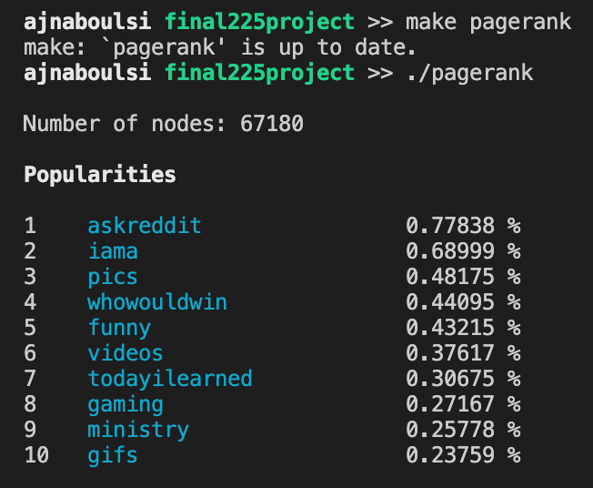
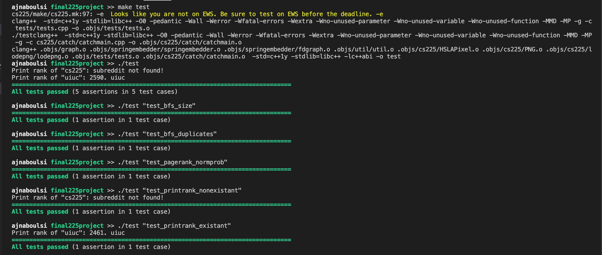

# CS 225 Data Structures

## Results Report
- Our initial goals for this project included processing Stanford’s Reddit Hyperlink Dataset into a directed graph and implementing Google’s PageRank algorithm along with mergesort. While working on the project, we decided to use a built-in sorting algorithm instead of mergesort as the built-one was already optimized with a better runtime. Instead, we implemented a force-directed graph algorithm called spring embedder, which we use to create a visual representation of the graph as a .gif file. Another one of our initial goals was to implement either a DFS or BFS traversal; we chose BFS because of its ability to find the shortest path from the starting node to any node in the graph.
- 
- The pagerank algorithm we implemented works as intended. When running it for a sufficient number of iterations and printing the top 10 popular subreddits, our program outputs askreddit as the most popular followed by iama, pics, whowouldwin, funny, videos, etc. These subreddits have very large followings which justifies their high popularity values in our pagerank algorithm. 
- As mentioned above, one of the graph algorithms we used was spring embedder, which helps create a visual of the graph. We were able to successfully implement the attractive forces that the algorithm uses, but we were unable to figure out how to get the repulsive forces to work as intended. As a result, we were able to create gifs representing the graph but they are not as accurate as they could be. The gifs that were created can be found in our GitHub under “reddit_animation_1.gif” and “reddit_animation_2.gif.”
- Finally, we implemented a BFS traversal of our directed graph. By implementing the predecessor and depth of each node in the graph, we can use our BFS algorithm to find the shortest path from the starting node to any other node in the graph. Our traversal outputs a vector of node pointers (pointers to the subreddits) in the correct BFS order.
- On top of these justifications, all of the test cases that we made passed when we ran our algorithms. Our test cases included a BFS size test which checks if the size of the graph is the same as the BFS traversal vector size; a BFS duplicates test which checks if any of the nodes in the traversal are repeated; a pagerank normalized probabilities test which checks if the popularities of our ranked subreddits add up to 100%; a printrank nonexistent test which prints the popularity of a nonexistent subreddit; and a printrank existent test which prints the popularity of an existent subreddit. As seen in the image below, we pass all of the test cases.
- 
